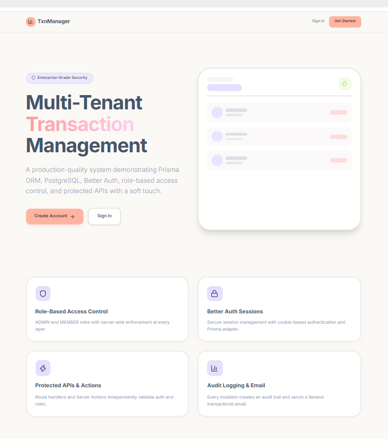

<div align="center">
  <h1>Multi-Tenant Transaction Management System</h1>
  <p>
    <strong>A production-quality Next.js application demonstrating authenticated, role-based transaction management with a full audit trail, transactional email, and webhook-backed delivery tracking.</strong>
  </p>

  <p>
    
    
    
    
  </p>

  <br />
  
  
</div>

<br />

---

## Table of Contents

1. [Overview](#1-overview)
2. [Architecture](#2-architecture)
3. [Features](#3-features)
4. [Tech stack](#4-tech-stack)
5. [Folder structure](#5-folder-structure)
6. [Database schema](#6-database-schema)
7. [Migrations](#7-migrations)
8. [Seeding](#8-seeding)
9. [Commands](#9-commands)
10. [Authentication (Better Auth)](#10-authentication-better-auth)
11. [Role-based access control](#11-role-based-access-control)
12. [Proxy / middleware](#12-proxy--middleware)
13. [Protected API endpoints](#13-protected-api-endpoints)
14. [Server actions](#14-server-actions)
15. [Email templates](#15-email-templates)
16. [Resend integration](#16-resend-integration)
17. [Resend webhook](#17-resend-webhook)
18. [Audit logging](#18-audit-logging)
19. [Environment variables](#19-environment-variables)
20. [Installation](#20-installation)
21. [Running in development](#21-running-in-development)
22. [Building for production](#22-building-for-production)
23. [Testing authorization](#23-testing-authorization)
24. [Evidence checklist](#24-evidence-checklist)

---

## 1. Overview

The system manages financial transactions for multiple users under two
roles — **ADMIN** and **MEMBER**. Every privileged action is
authenticated by Better Auth, authorized by a centralised RBAC layer, validated
with Zod, persisted with Prisma, recorded in an audit log, and confirmed by a
transactional email whose delivery is tracked through a signed Resend webhook.

The defining rule of the codebase: **the server never trusts the client.** The
acting user's ID and role always come from the session, never from a request
body, header or form field.

---

## 2. Architecture

```text
Browser ──▶ proxy.ts ──▶ Pages / Route handlers / Server actions
                              │
                       lib/authorization.ts  (requireAuth / requireRole)
                       lib/validation        (Zod)
                              │
                          Prisma ──▶ PostgreSQL
                              │
                     Resend ──▶ /api/webhooks/resend ──▶ EmailEvent
```

The proxy is the *first* line of defence, never the only one — every handler
and server action re-validates the session and role independently. A full
narrative with diagrams lives in [`docs/ARCHITECTURE.md`](docs/ARCHITECTURE.md).

---

## 3. Features

**Admin**
- Organisation-wide dashboard: total users, total transactions, audit and email
  event counts, completed value
- User directory with role badges and per-user transaction counts
- Recent transactions across all accounts
- Recent audit events and Resend email events

**Member**
- Personal dashboard scoped to their own transactions
- Create transactions with per-field validation
- Transaction history with reference, type, status and amount

**Cross-cutting**
- Email/password authentication with sign-up and sign-out
- Audit log on every privileged mutation
- Transactional email with delivery tracking
- Responsive, accessible UI with loading, empty and error states

---

## 4. Tech stack

| Concern | Choice |
| --- | --- |
| Framework | Next.js 16 (App Router, React Server Components) |
| Language | TypeScript (strict) |
| Styling | Tailwind CSS v4 with design tokens |
| Components | shadcn/ui-style primitives, Lucide icons |
| ORM | Prisma 6 |
| Database | PostgreSQL |
| Auth | Better Auth (Prisma adapter, email/password) |
| Validation | Zod |
| Email | React Email + Resend |
| Webhooks | Svix signature verification |
| Seeding | @faker-js/faker |

---

## 5. Folder structure

```text
transaction-management/
├── app/
│   ├── (auth)/
│   │   ├── login/page.tsx
│   │   └── signup/page.tsx
│   ├── actions/
│   │   └── transaction-actions.ts       server actions
│   ├── admin/page.tsx                   ADMIN console
│   ├── dashboard/page.tsx               role-aware dashboard
│   ├── transactions/page.tsx            MEMBER/ADMIN workspace
│   ├── api/
│   │   ├── auth/[...all]/route.ts       Better Auth handler
│   │   ├── admin/route.ts               ADMIN stats
│   │   ├── admin/users/route.ts         ADMIN user list
│   │   ├── admin/audit-logs/route.ts    ADMIN audit log
│   │   ├── transactions/route.ts        MEMBER/ADMIN GET + POST
│   │   ├── users/route.ts               own profile
│   │   └── webhooks/resend/route.ts     signed webhook receiver
│   ├── globals.css                      Tailwind v4 design tokens
│   ├── layout.tsx
│   └── page.tsx                         public landing page
├── components/
│   ├── admin/                           users, audit log, email event tables
│   ├── auth/                            login + signup forms
│   ├── dashboard/                       shell, stat card, sign-out
│   ├── transactions/                    table + create form
│   └── ui/                              button, card, input, table, badge…
├── emails/
│   ├── TransactionCreated.tsx
│   └── AccountActivityAlert.tsx
├── lib/
│   ├── auth/auth.ts, auth-client.ts
│   ├── authorization.ts                 centralised RBAC
│   ├── email/resend.ts
│   ├── validation/schemas.ts
│   ├── prisma.ts
│   ├── reference.ts                     TXN-XXXXXXXX generator
│   └── utils.ts
├── prisma/
│   ├── schema.prisma
│   ├── migrations/
│   └── seed.ts
├── docs/
│   ├── ARCHITECTURE.md
│   └── EVIDENCE_CHECKLIST.md
├── proxy.ts                             route protection
└── .env.example
```

---

## 6. Database schema

Entities: **User**, **Transaction**, **AuditLog**, **EmailEvent**, plus
**Session**, **Account** and **Verification** managed by Better Auth.

Enums: `UserRole` (ADMIN/MEMBER), `TransactionType` (CREDIT/DEBIT),
`TransactionStatus` (PENDING/COMPLETED/FAILED/CANCELLED), `AuditAction`,
`EmailEventType`.

Relationships:

```text
User 1───* Transaction   onDelete: Cascade
User 1───* AuditLog      onDelete: SetNull   (preserve the trail)
User 1───* EmailEvent    onDelete: SetNull
User 1───* Session       onDelete: Cascade
User 1───* Account       onDelete: Cascade
```

All primary keys are CUIDs. `Transaction.reference` is a unique human-readable
`TXN-XXXXXXXX` code. Indexes cover every filter and sort column.

`AuditLog.entityId` is a **polymorphic pointer** — it may reference a
Transaction, a User or a Session — so it is indexed but deliberately not a
foreign key. Only the actor (`userId`) is a real relation.

---

## 7. Migrations

Migrations live in `prisma/migrations/` and are applied with Prisma Migrate.

```bash
npm run db:migrate        # create + apply a migration in development
npm run db:deploy         # apply existing migrations (CI / production)
npm run db:reset          # drop, re-migrate and re-seed (destructive)
```

Never edit an applied migration. Change `schema.prisma` and create a new one.

---

## 8. Seeding

`prisma/seed.ts` uses Faker and inserts **parents before children**, reusing
the returned IDs — no random or invented foreign keys anywhere.

Order: users → credential accounts → transactions → audit logs → email events.

It creates 12 users (4 fixed test accounts + 8 random), 60 transactions, audit
logs for user creation, transaction creation and logins, and 30 email events.
Each user gets a real Better Auth credential account hashed with Better Auth's
own `hashPassword()`, so the seeded accounts can actually sign in.

The shared demo password is read from `SEED_USER_PASSWORD` and is **never
printed**. The seed prints counts only:

```text
  Users created    : 12
  Transactions     : 60
  Audit logs       : 67
  Email events     : 30
  Credential accts : 12
```

Test accounts:

| Email | Role |
| --- | --- |
| `admin@txnmanager.dev` | ADMIN |
| `alice@txnmanager.dev` | MEMBER |
| `bob@txnmanager.dev` | MEMBER |

---

## 9. Commands

| Command | Purpose |
| --- | --- |
| `npm run dev` | Start the development server |
| `npm run build` | Production build |
| `npm run start` | Serve the production build |
| `npm run lint` | ESLint |
| `npm run typecheck` | `tsc --noEmit` |
| `npm run db:generate` | Generate the Prisma client |
| `npm run db:migrate` | Create and apply a migration |
| `npm run db:deploy` | Apply migrations without prompting |
| `npm run db:seed` | Seed the database with Faker data |
| `npm run db:reset` | Reset and re-seed (destructive) |
| `npm run db:studio` | Open Prisma Studio |
| `npm run email:dev` | Preview the React Email templates |

---

## 10. Authentication (Better Auth)

`lib/auth/auth.ts` configures Better Auth with the Prisma adapter and the
email/password provider. Passwords are hashed by Better Auth; no plaintext
password is ever stored, logged or committed. Sessions live in the `Session`
table and the browser holds only an httpOnly cookie.

The `role` field is exposed on the session but declared `input: false`, so a
client cannot assign itself a role at sign-up. Every new account starts as
**MEMBER**. An administrator can promote a member to ADMIN.

`lib/auth/auth-client.ts` provides `signIn`, `signUp`, `signOut` and
`useSession` for client components.

---

## 11. Role-based access control

All authorization funnels through `lib/authorization.ts`:

```ts
requireAuth()               // any signed-in user, else 401
requireRole([...roles])     // role must be in the list, else 403
requireMember()             // MEMBER or ADMIN
requireAdmin()              // ADMIN only
```

Each resolves the session server-side and throws an `AuthorizationError` with a
`statusCode`. Route handlers convert it to JSON; pages convert it to a redirect.
The role is read from the database-backed session — a client-supplied role
field is ignored everywhere.

| Capability | MEMBER | ADMIN |
| --- | :---: | :---: |
| `/dashboard` | own data | all data |
| `/transactions` | own | all |
| `/admin` | — | yes |
| Create transaction | yes | yes |
| Admin APIs | — | yes |

---

## 12. Proxy / middleware

Route protection runs **before route resolution** in `proxy.ts`.

> **Version note.** Next.js 16 renamed this file: it is `proxy.ts` exporting
> `proxy()`. On Next.js 13–15 the identical file is `middleware.ts` exporting
> `middleware()`. This project runs Next.js 16, so `proxy.ts` is used; the note
> is repeated at the top of the file.

It allows the public list (`/`, `/login`, `/signup`, `/api/auth`), then:

- **No session cookie** — API paths get `401` JSON, page paths redirect to
  `/login?callbackUrl=…`
- **`/admin` and `/api/admin`** — require ADMIN, else `403` or a redirect to
  `/dashboard?error=forbidden`
- **`/api/transactions`** — requires MEMBER or ADMIN
- **`/dashboard`, `/transactions`** — require a valid session

**Security rule:** this layer is convenience and speed, not the guarantee. Every
route handler and server action re-validates authorization on its own.

---

## 13. Protected API endpoints

Each protected handler follows the same pipeline:

```text
session → authentication → role check → Zod validation → Prisma → safe JSON
```

| Endpoint | Method | Required role |
| --- | --- | --- |
| `/api/transactions` | GET | MEMBER (own) / ADMIN (all) |
| `/api/transactions` | POST | MEMBER or ADMIN |
| `/api/admin/users` | GET | ADMIN |
| `/api/admin/audit-logs` | GET | ADMIN |
| `/api/admin` | GET | ADMIN |
| `/api/users` | GET | any signed-in user (own profile only) |

Responses use explicit Prisma `select` projections. Password hashes, session
tokens and provider identifiers are never returned. Unexpected errors are
logged server-side and answered with a generic message.

---

## 14. Server actions

`app/actions/transaction-actions.ts` contains `createTransaction` and the
admin-only `deleteTransaction`.

```text
Client → Server Action
   1. requireMember()                    session + role, server-side
   2. createTransactionSchema.safeParse  Zod
   3. prisma.$transaction                transaction row + audit log
   4. sendTransactionEmail()             after commit, non-fatal
   5. revalidatePath()                   refresh the UI
   6. return { success, data }           safe fields only
```

`userId` is taken from the authenticated session and is not part of the input
schema, so a spoofed value in the payload is discarded before it reaches the
database. The audit log is written inside the same database transaction, so it
can never drift from the data it describes.

---

## 15. Email templates

Built with `@react-email/components` in `emails/`:

- **`TransactionCreated.tsx`** — confirmation of a new transaction
- **`AccountActivityAlert.tsx`** — security/activity notification

Both use a professional responsive layout with the app name and logo mark, the
recipient's name, transaction details, a formatted timestamp, a call-to-action
button linking back to the dashboard, and a footer. No secrets are hardcoded;
links are built from `APP_URL`. Preview them with `npm run email:dev`.

---

## 16. Resend integration

`lib/email/resend.ts` is the single place the Resend SDK is used. It exposes
`sendTransactionEmail()` and `sendActivityAlert()`, both returning a typed
`EmailResult` of `{ success, id? , error? }`.

Sequence after a successful mutation: **database commit → audit log → email →
capture the returned message ID**. A failed send is logged on the server and
returned as a soft failure; it never rolls back committed data and never
surfaces a provider error or API key to the browser.

---

## 17. Resend webhook

`app/api/webhooks/resend/route.ts` receives delivery events.

1. Read the **raw** request body and the `svix-id`, `svix-timestamp` and
   `svix-signature` headers
2. Verify the signature with `RESEND_WEBHOOK_SECRET` using Svix — Resend's
   official mechanism. An invalid signature is rejected with `401` and nothing
   is written
3. Validate the payload with Zod
4. Map `email.sent`, `email.delivered`, `email.bounced` and `email.failed` to
   `EmailEventType`
5. Store an `EmailEvent` with the event ID, message ID, recipient, event type,
   timestamp and raw payload

`eventId` is unique, so a replayed delivery is a harmless no-op. The secret is
never logged.

Configure the endpoint in the Resend dashboard as
`https://<your-domain>/api/webhooks/resend`.

---

## 18. Audit logging

Every `AuditLog` row records the acting user, the action enum, the entity name,
the affected entity ID, optional JSON metadata, IP address, user agent and the
timestamp. Logs are written inside the mutation's database transaction and are
visible to admins at `/admin` and through `/api/admin/audit-logs`. Deleting a
user sets the actor to null rather than removing the history.

---

## 19. Environment variables

Copy `.env.example` to `.env.local` and fill it in. **Never commit real
credentials.**

| Variable | Purpose |
| --- | --- |
| `DATABASE_URL` | PostgreSQL connection string |
| `BETTER_AUTH_SECRET` | Session signing secret (`openssl rand -base64 32`) |
| `BETTER_AUTH_URL` | Base URL Better Auth serves from |
| `APP_URL` | Server-side app URL, used in email links |
| `NEXT_PUBLIC_APP_URL` | Browser-side app URL |
| `RESEND_API_KEY` | Resend API key |
| `RESEND_FROM_EMAIL` | Verified sender address |
| `RESEND_WEBHOOK_SECRET` | Signing secret from the Resend webhook settings |
| `SEED_USER_PASSWORD` | Shared password for seeded demo accounts |

`.gitignore` excludes `.env`, `.env.local`, `node_modules` and `.next`.

---

## 20. Installation

```bash
git clone <repository-url>
cd Assignment2/transaction-management

npm install
cp .env.example .env.local        # then edit the values

npm run db:generate
npm run db:migrate
npm run db:seed
```

Requires Node.js 20+ and a running PostgreSQL instance.

---

## 21. Running in development

```bash
npm run dev
```

Open <http://localhost:3000>. Sign in with one of the seeded accounts using the
password you set in `SEED_USER_PASSWORD`.

Preview the email templates separately with `npm run email:dev`.

---

## 22. Building for production

```bash
npm run lint
npm run typecheck
npm run build
npm run start
```

In a deployment pipeline, run `npm run db:deploy` instead of `db:migrate`.

---

## 23. Testing authorization

Sign in as each role and confirm:

**ADMIN** — `/admin` renders; user, audit and email tables populate;
`/api/admin/users` returns 200.

**MEMBER** — `/transactions` renders only their own rows; creating a
transaction succeeds; `/admin` redirects to `/dashboard?error=forbidden`;
`/api/admin/users` returns 403.

**Signed out** — protected pages redirect to `/login`; protected APIs return
401 JSON.

Spoofing check — as a MEMBER, POST to `/api/transactions` with an extra
`"userId"` belonging to someone else. The created row is still owned by the
signed-in member, because the field is stripped by the Zod schema and the owner
comes from the session.

```bash
curl -i -X POST http://localhost:3000/api/transactions \
  -H "Content-Type: application/json" \
  -b cookies.txt \
  -d '{"title":"Test","amount":100,"type":"CREDIT","userId":"someone-else"}'
```

---

## 24. Evidence checklist

See [`docs/EVIDENCE_CHECKLIST.md`](docs/EVIDENCE_CHECKLIST.md) for the full
capture list. Tick an item only after observing the result yourself — never
fabricate evidence.
