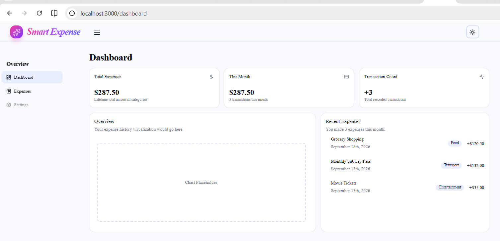
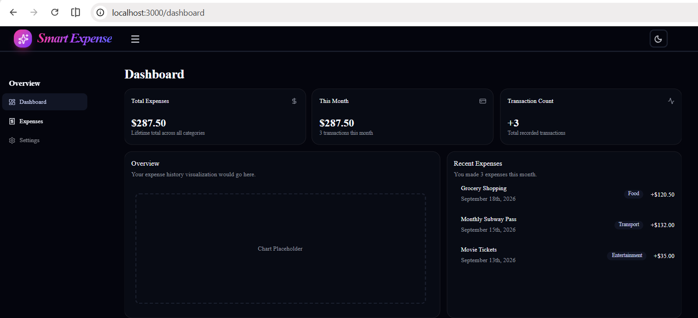

# Full Stack Development Assignments

This repository contains two Next.js web applications completed as assignments. Each assignment is located in its respective folder and includes its own detailed documentation.

## 📁 Repository Structure

### 1. Expense Tracker (Assignment 1)
A comprehensive expense tracking dashboard that allows users to monitor, filter, and manage their expenses with a beautiful and responsive UI.
- **Location:** [`./Assignment1`](./Assignment1)

#### UI Preview

  
  &nbsp;
  

---

### 2. Transaction Management System (Assignment 2)
A secure transaction management system featuring role-based access control (RBAC), admin dashboards, audit logs, and email notifications.
- **Location:** [`./Assignment2/transaction-management`](./Assignment2/transaction-management)

#### UI Preview

  

---

## 🛠️ Tech Stack
- **Framework:** Next.js (App Router)
- **Styling:** Tailwind CSS & shadcn/ui
- **Language:** TypeScript
